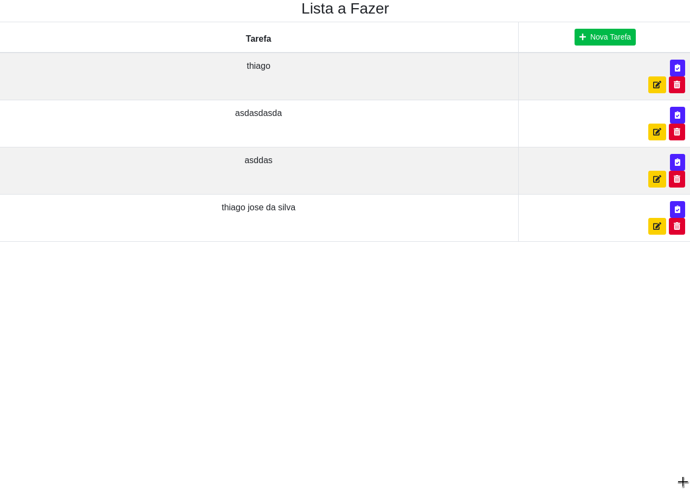

# Projeto Lista de Tarefas:

* Projeto para treinamento em reactjs, usando a plataforma de cursos udemy

* Dentro do <b>README</b> da pasta do projeto está tudo que está sendo usando.
   * https://github.com/thiagoadssilva/udemyListaTarefas/blob/main/frontend/README.md

## Observações 
- Todo parte das informações das tarefa está sendo feita através de uma api, porém essa api, não está usando banco de dados, apenas a memoria.
   - Projeto da API está no link: 
         https://github.com/thiagoadssilva/udemyListaTarefasApi

## <b>Cadastrar Tarefa</b> 

## <b>Listagem de Tarefas</b> 

## <b>Concluir Tarefa</b> 

## <b>Remover Tarefa</b> 

## <b>Paginação</b> 

## <b>Ordenação</b> 

## <b>Filtro</b> 

## <b>Atualizar Tarefa</b> 

