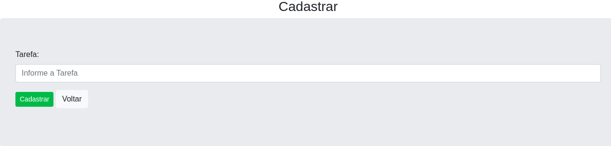

# Projeto Lista de Tarefas:

* Projeto para treinamento em reactjs, usando a plataforma de cursos udemy

* Dentro do <b>README</b> da pasta do projeto está tudo que está sendo usando.
   * https://github.com/thiagoadssilva/udemyListaTarefas/blob/main/frontend/README.md

## <b>Inicio</b> 

## <b>Listagem de Tarefas</b> 

## <b>Concluir Tarefa</b> 

## <b>Remover Tarefa</b> 

